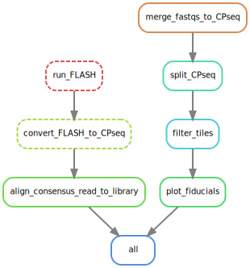

# array analysis snakemake workflow

Yuxi Ke, Nov 2021

# Setup

## Install snakemake

Install an environment with snakemake:

```bash
conda install -y -c conda-forge mamba
mamba create -y -c conda-forge -c bioconda -n snakemake snakemake numpy pandas matplotlib seaborn
```

This may take a while.

If snakemake says mamba is not installed, run

```bash
conda install -y -n snakemake -c conda-forge mamba
```

while snakemake environment is activated.

## Install Ben Parks' snakemake slurm profile

```bash
git clone https://github.com/bnprks/snakemake-slurm-profile.git
bash install_snakemake_profile.sh
```

Ben's defaults are:

```bash
"time" : "01:00:00",
"cores" : "{threads}",
"partition" : "wjg,biochem,sfgf",
"priority" : "normal",
"memory" : "8G"
```

To use this slurm profile in the Snakefile with costumed parameters, add in the `params:` section:

```bash
rule my_job:
    input: ...
    output: ...
    threads: 8
    params:
        cluster_memory = "12G",
        cluster_time = "4:00:00",
        num_cores = "6"
    shell: ...
```

## Clone the array analysis snakemake workflow [still under development use with caution]

I put mine at `$GROUP_HOME`

```bash
git clone https://github.com/keyuxi/array_analysis.git
```

## Install FLASH if doing alignment

For aligning paired end reads. The path should be entered in the snakemake configuration file.

# Running the workflow

## High level overview

To run, copy a configuration yaml file in the `config` directory for the experiment and make modifications. Usually, make one config file that corresponds to one working directory on `$SCRATCH` or `$GROUP_SCRATCH` (recommended) for each MiSeq chip. An example yaml file is pasted below:

```yaml
# === Experiment-dependent configurations === #
experimentName:
    NNNlib2b
processingType:
    # either 'pre-array' or 'post-array'
    # 'pre-array' for sequencing processing only
    pre-array
datadir:
    /scratch/groups/wjg/kyx/NNNlib2b_Nov11/data/
fastq:
    read1:
        /oak/stanford/groups/wjg/kyx/data/NNNlib2b_processing_20211111/NNNlib2b_S1_L001_R1_001.fastq
    read2:
        /oak/stanford/groups/wjg/kyx/data/NNNlib2b_processing_20211111/NNNlib2b_S1_L001_R2_001.fastq
sequencingResult:
    # csv (CPseq) file holding sequencing data aligned to the library
    # ocation: {datadir}/aligned/
    ConsensusReads_20211115_exact.CPseq
referenceLibrary:
    # RefSeqs of the library design for alignment
    # should have a column named 'RefSeq'
    /scratch/groups/wjg/kyx/NNNlib2b_Nov11/data/reference/NNNlib2b_RefSeqs.csv
tifdir:
    # directory holding all tif images, with a trailing slash
    /scratch/groups/wjg/kyx/NNNlib2b_Nov11/data/images_20211022/
fluordir:
    # output directory for CPfluor files, with a trailing slash
    # recommemded: {datadir}/fluor/
    /scratch/groups/wjg/kyx/NNNlib2b_Nov11/data/fluor/
seriesdir:
    # output directory for CPseries files, with a trailing slash
    # recommended: {datadir}/series/
    /scratch/groups/wjg/kyx/NNNlib2b_Nov11/data/series/
mapfile:
    # a csv file with column `condition`
    config/nnnlib2b_map.csv
FIDfilter:
    data/reference/FID.CPfilter
LibRegionFilter:
    data/reference/LibRegion.CPfilter
# ====== Environment Configurations =====
FLASHdir:
    /home/groups/wjg/kyx
```

Example directory structure of the data processing directory is approximately like this, where different subfolders in `data` are different steps of processing. Note that you may include different days of array data here.

I also currently keep the folders of images for registration here and run a bash script stored in `bash_scripts` on array day. This is fast and it works, but may be incorporated in the future.

```bash
NNNlib2b_Oct6
├── bash_scripts
├── data
│   ├── aligned
│   ├── fastq
│   ├── fiducial_images
│   ├── filtered_tiles
│   ├── filtered_tiles_libregion
│   ├── fluor
│   ├── images_20211019
│   ├── images_20211022
│   ├── library
│   ├── Red05_Fid
│   ├── Red_08_Fid
│   ├── Red09_PostQuench
│   ├── reference
│   ├── roff
│   ├── tiles
│   └── tmp
├── fig
│   └── fiducial
├── NNN_scripts
└── out
```

An example workflow after sequencing but before array experiment may look like:



an example workflow after sequencing but before array experiment

Before running the workflow,

```yaml
conda activate snakemake
snakemake -np | less
```

for a dry run. Snakemake will print out the commands to execute.

To execute, run

```yaml
snakemake --profile slurm --use-conda
```

The jobs will be automatically submitted in the right order.

## Tell snakemake which configuration file to use

At the beginning of `Snakefile`, modify here

```yaml
####### SELECT CONFIG FILE HERE #######
configfile: "config/config_NNNlib2b_Nov11.yaml"
#######################################
```

## Modifying the configuration file

### Sequencing data processing

1. At the end of the configuration, change the `FLASH` location to where you installed it
    
    ```yaml
    # ====== Environment Configurations =====
    FLASHdir:
        /home/groups/wjg/kyx
    ```
    
2. The experiment name will show up in some of the processed data file names and is quite flexible:
    
    ```yaml
    experimentName:
        NNNlib2b
    ```
    
3. Depending on whether you are only processing the sequencing data or the array data, set
    
    ```yaml
    processingType:
        # either 'pre-array' or 'post-array'
        # 'pre-array' for sequencing processing only
        pre-array
    ```
    
4. Add the locations of your main data processing directory. Point to where the fastq files and your reference library are located
    
    ```yaml
    datadir:
        /scratch/groups/wjg/kyx/NNNlib2b_Nov11/data/
    fastq:
        read1:
            /oak/stanford/groups/wjg/kyx/data/NNNlib2b_processing_20211111/NNNlib2b_S1_L001_R1_001.fastq
        read2:
            /oak/stanford/groups/wjg/kyx/data/NNNlib2b_processing_20211111/NNNlib2b_S1_L001_R2_001.fastq
    referenceLibrary:
        # RefSeqs of the library design for alignment
        # should have a column named 'RefSeq'
        /scratch/groups/wjg/kyx/NNNlib2b_Nov11/data/reference/NNNlib2b_RefSeqs.csv
    ```
    
    Your reference library should be what you designed and in read1 orientation. The sequences should be in a column named `RefSeq` (case sensitive).
    
    I left the name of the output of the alignment customizable in case one needs to play with alignment parameters. 
    

The fiducial filter file is included in the github repository. If you used a different fiducial (unlikely), you may need to point to another fiducial file.

You will get:

- Fiducial filtered CPseq files for registration on the array day and plots of them in `fig/fiducial`
- CPseq file aligned to the designed library and an aggregated STATS report
- TODO: Add QC plots of the sequencing results to the workflow

## Run it

Run with `-np` for a dry run. Snakemake will print out the commands to execute.

```yaml
conda activate snakemake
snakemake -np | less
```

Optionally, plot the DAG with

```bash
snakemake --dag | dot -Tsvg > dag.svg
```

To execute, run

```yaml
snakemake --profile slurm --use-conda
```

The jobs will be automatically submitted in the right order. I tested once and if you shut down you computer after the first jobs were submitted and walk away, it should be fine even if the future jobs were not yet submitted.